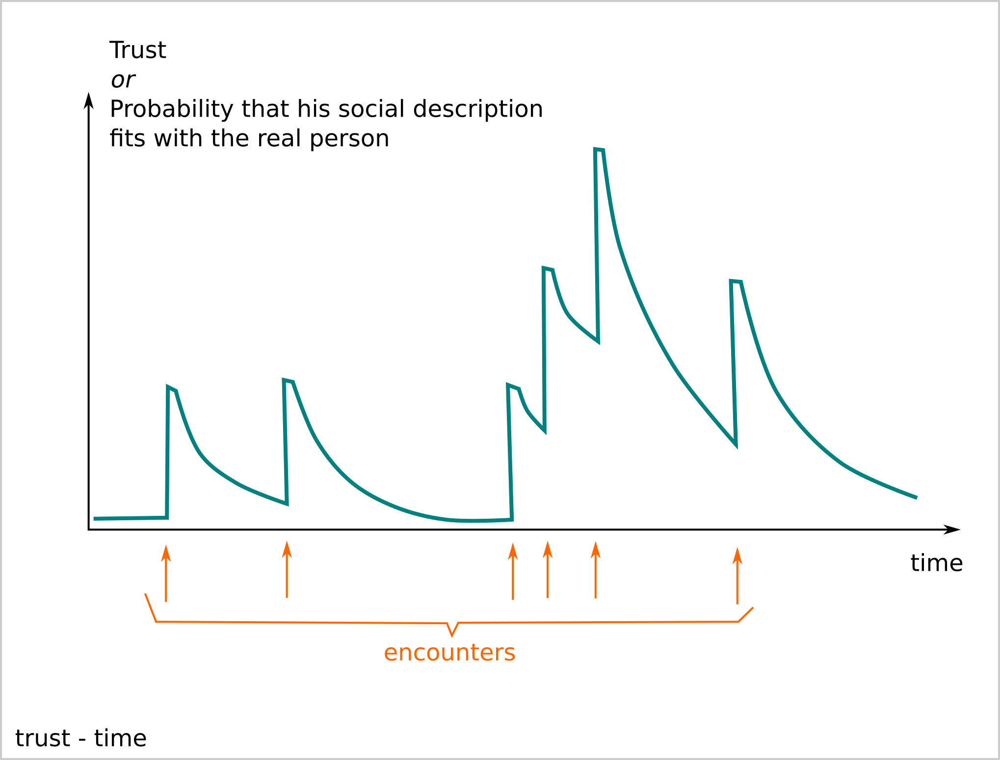
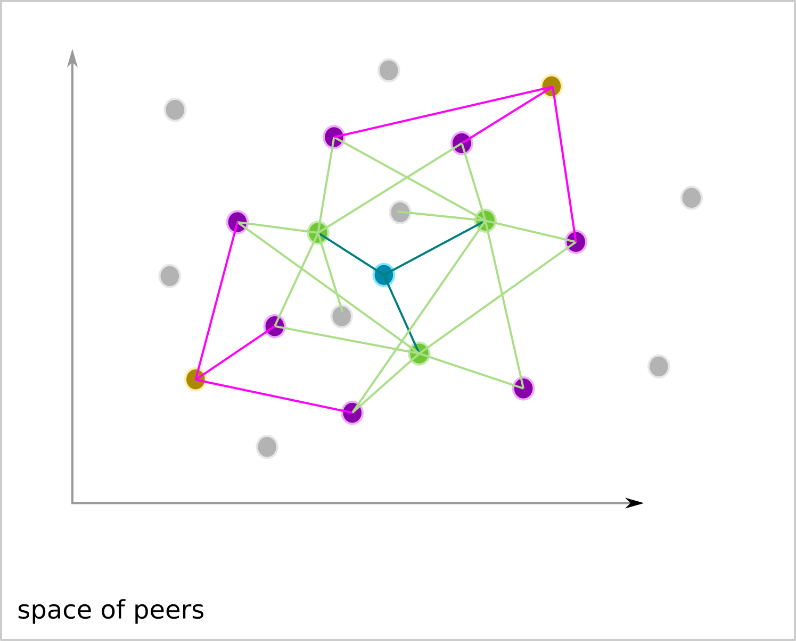
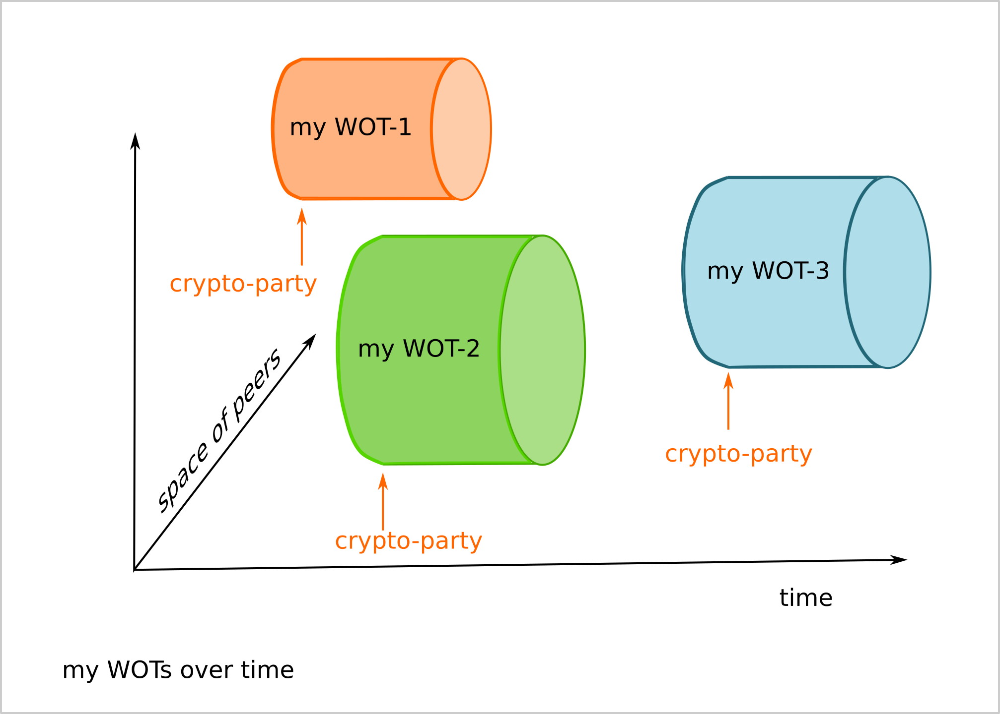

==============
Notes on Wendy
==============

Presentation
============

*Wendy* is a small website that intents to ease the creation of *web of trust*. It is typically used during a *crypto-party*.

Why a web of trust
==================

A *web of trust* is a requirement to create *via internet* the following events or organizations :

- voting or election
- crypto-currency
- transparent digital organization
- mail communication without spam
- decentralized facebook

Concepts
========

Bootstraping the trust
----------------------

To bootstrap the *trust*, physical and direct encounters are needed. The cryptographic algorithms are able to maintain the *trust* between people who encounter each other but are not able to create the *trust* through internet. The origin of the *trust* is always social. The cryptography is an helper-tool that reinforces the *social trust*.

In this document, *trust* means 'I know that this guy exists' or more accurately, 'I have encountered this guy on that date'. Then, the cryptography will help us to ensure that his future messages are really coming from the encountered person, avoiding any usurping of his identity. Optionally, the cryptography could also be used to restrict the visibility of a message to a sub-group (a.k.a. secret message).

The exact meaning of 'this guy' is also floating. It refers to some descriptions of the person, that needs to be specified depending on the purpose of the *web of trust*. The minimum requirement is that, within the concerned social group, the description of 'this guy' is unique and clear enough, so the person can be recognized or identified. Actually, a *web of trust* is the cryptographic translation of 'one person, one vote'.

The Bitcoin case
----------------

The original intention of *Bitcoin* was to spread the money creation through the users instead of having it concentrated within few banks. Its algorithm was selecting a server randomly every 5 minutes via the *proof of work* for this purpose. But because of the lack of *web of trust*, it comes that some people acquired more and more servers to profit more from the currency creation.

The definitions of Trust
------------------------

In this context, *trust* is not evaluating if a person is loyal, honest or reliable. The level of confidence between the peers will increase or decrease over the time through their interactions and behaviors. The cryptography just help to avoid falsified identity. It eases the creation of *white list* and *black list*. It avoids *spam* and unwanted communication with robot. It enables the application of personal rules for his own communications.

A *web of trust* is a graph that shows who and when the people have encountered themselves to certificate each other. The goal is to be sure we communicate with a person we have encountered or with a person that has encountered a person that I have encountered and so on. It is a cartography of the connections between the users. Notice that it does not contain necessary all connections. And by certifying a person you just proof that you have encountered him or her but not that you support his activities.

*Internet* is only useful if it lets people communicate with each other. We need to find the people through the tons of IPs and URLs.

Single responsibility principal
-------------------------------

Some crypto-currencies like G1_ uses already their *web of trust*. The goal of *Wendy* is to address the creation of a *Web of trust*, regardless of the application build on top of it.

.. _G1: https://monnaie-libre.fr/

How to make a WOT
=================

#. people join a location at an announced date (a.k.a. crypto-party)
#. each participant creates a key-pair on his device
#. each participant create his profile that describes himself according to some agreed criteria
#. each participant crypto-signed his own profile
#. the participants exchange their profiles and crypto-sign the profiles from others
#. each participant uploads from his device to a local server the profiles from others that he has signed
#. each participant downloads all profiles and signatures from the local server
#. each profile makes his own *web of trust* according to his criteria

Typical WOT
===========

Below an example of criteria to create a WOT.

After a certain time, the value of the WOT decreases. Each one can set an expiration time that he considers that his WOT is not valid any more.

We can create more complex point system to build a WOT, where the value of trust of a peer decrease slowly over time.

To extend the network, it can be useful to add in the profile a URL or a static IP to communicate via Internet further.

Links around Wendy
==================

- GitHub_
- ReadTheDocs_
- `ReadTheDocs status`_
- Netlify_
- `Netlify status`_

.. _GitHub : https://github.com/charlyoleg/wendy
.. _ReadTheDocs : https://wendy.readthedocs.io/en/latest/
.. _`ReadTheDocs status` : https://app.netlify.com/sites/infallible-brahmagupta-743a4c/deploys
.. _Netlify : https://infallible-brahmagupta-743a4c.netlify.com/
.. _`Netlify status` : https://readthedocs.org/projects/wendy/

